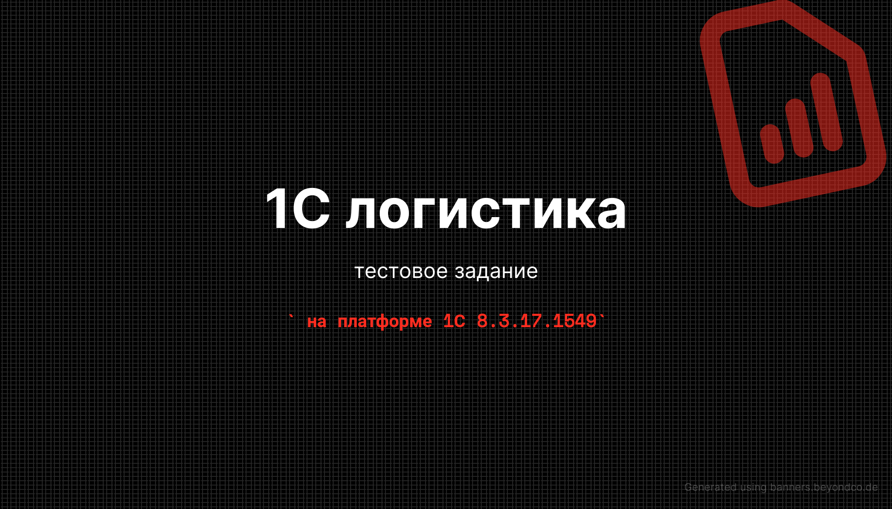
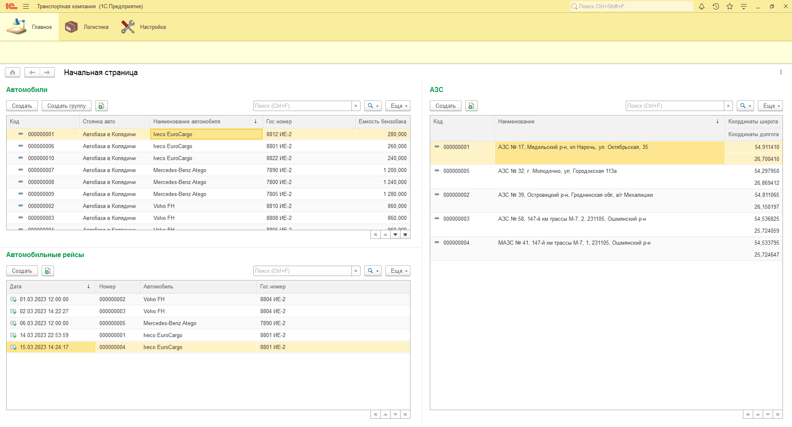
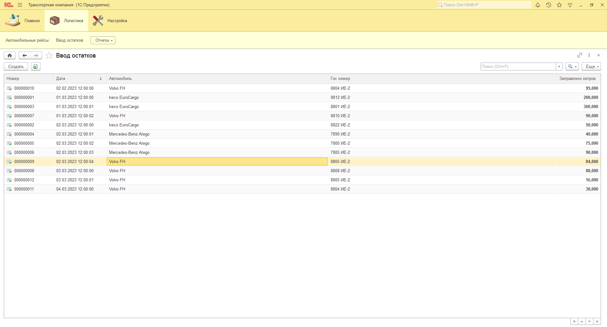
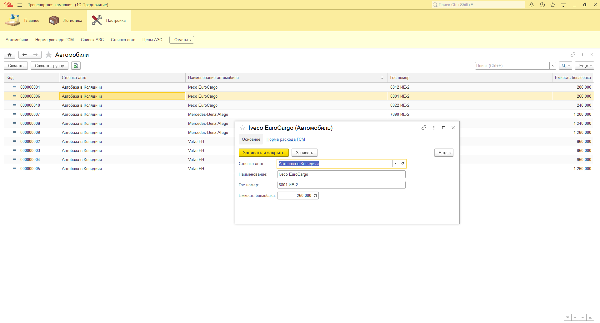
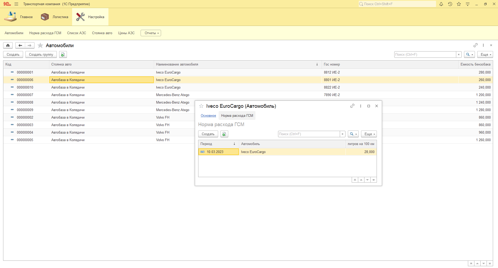
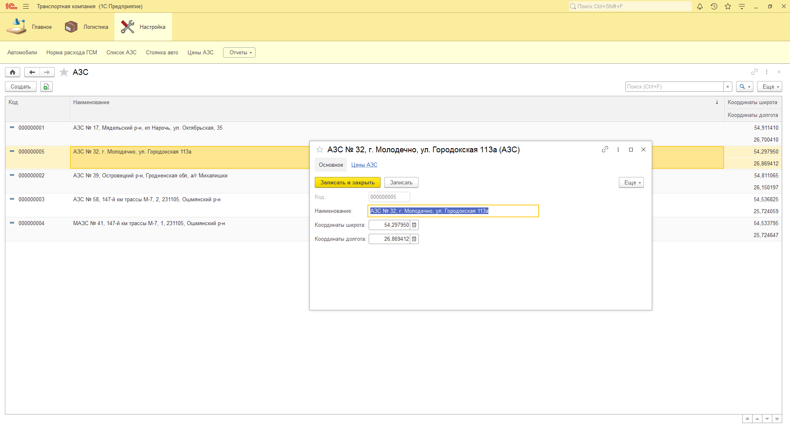
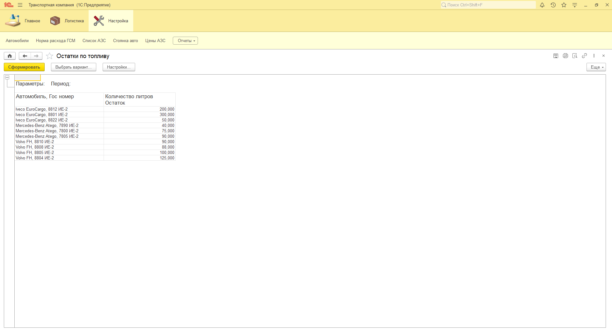
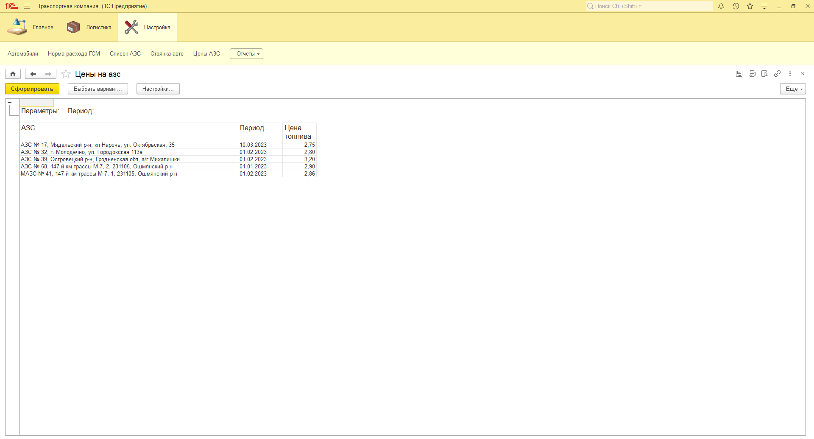
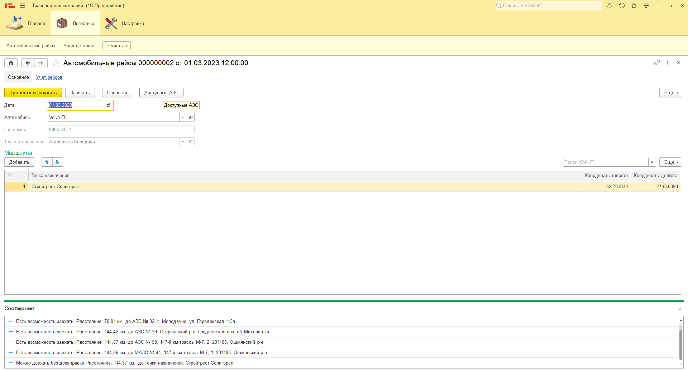

<kbd></kbd>

> Логистика — совокупность организационно-управленческих и производственно-технологических процессов по эффективному обеспечению различных систем товарно-материальными ресурсами. [**Википедия**](https://ru.wikipedia.org/wiki/%D0%9B%D0%BE%D0%B3%D0%B8%D1%81%D1%82%D0%B8%D0%BA%D0%B0)

## 1C конфигурация для транспортной компании >>> :hammer_and_pick:

 - язык программирования = 1С
 
### Описание технического задания :gear:

**Создание конфигурации на управляемом приложении, позволяющую выполнять подбор АЗС для автомобиля в отправляемого в рейс.**

- В организации имеется список некоторых авто, которые периодически отправляются в рейс. 
- Рейс состоит из точек маршрута по координатам GPS, которые должен посетить автомобиль. 
- Каждый автомобиль имеет топливный бак, который может быть разного объема. 
- На каждый автомобиль устанавливается норма расхода топлива, которая может изменяться с периодом времени. 
- Заправляется автомобиль на заправочных станциях партнеров, для которых указана цена топлива и координаты GPS. 

**Результатом разработки должна быть возможность:**

- ввести данные о рейсах автомобилей; 
- подобрать возможные к посещению заправочные станции; 
- получить текущие остатки топлива автомобиля.

**Конфигурация должна позволить:**

- Ввести список автомобилей с гос. номером, емкостью бака. 
- Ввести список заправок с координатами GPS и стоимостью топлива (достаточно одного вида топлива). 
- Задать норму расхода топлива для конкретного автомобиля 
(норма может быть разной в зависимости от периода).
- Ввести сведения о количестве заправленного топлива для автомобиля.
- Получить текущие остатки топлива у автомобиля.
- Отправить автомобиль в рейс с указанием точек маршрута по координатам GPS.
- На основе указанных координат маршрута подобрать доступные заправки по координатам GPS 
(расчет расстояния выполнять по прямой) с учетом доступного остатка в баке.

- и тп и мн.др.

***Приветствуются все пожелания и предложения по работе системы >>> :envelope:***

<kbd></kbd>
<kbd></kbd>
<kbd></kbd>
<kbd></kbd>
<kbd></kbd>
<kbd></kbd>
<kbd></kbd>
<kbd></kbd>